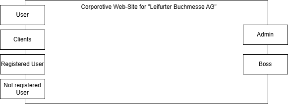
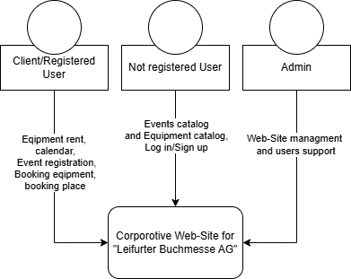
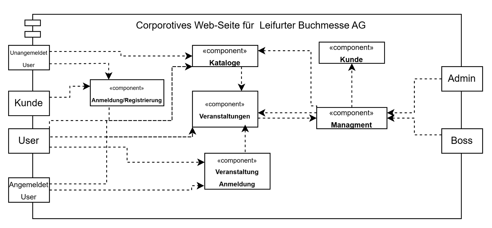
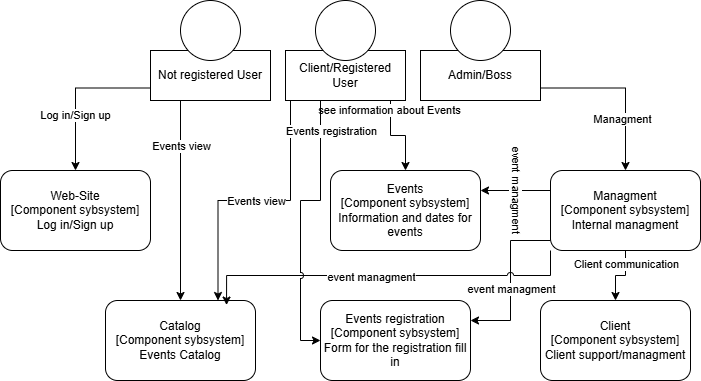
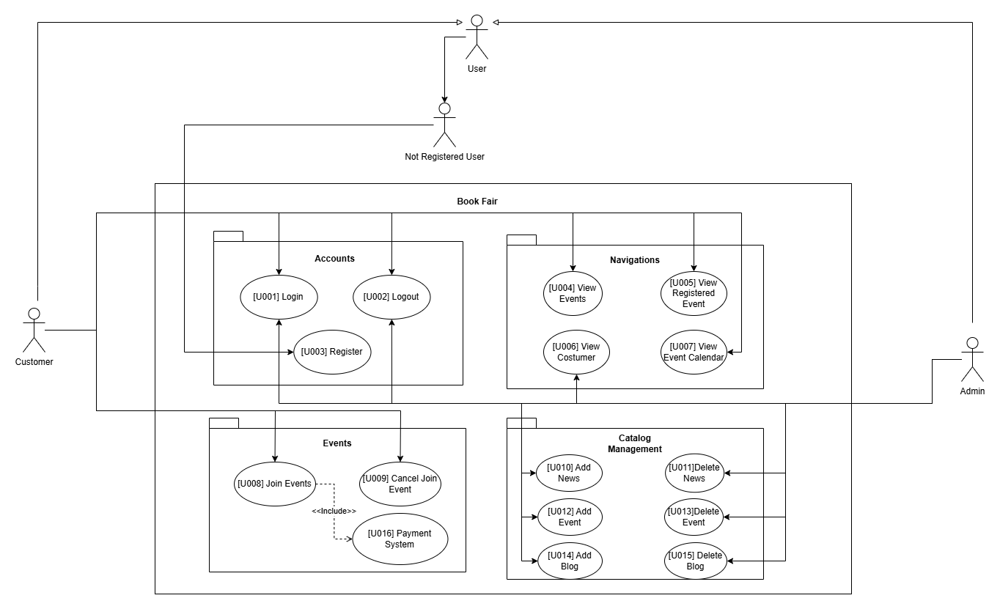
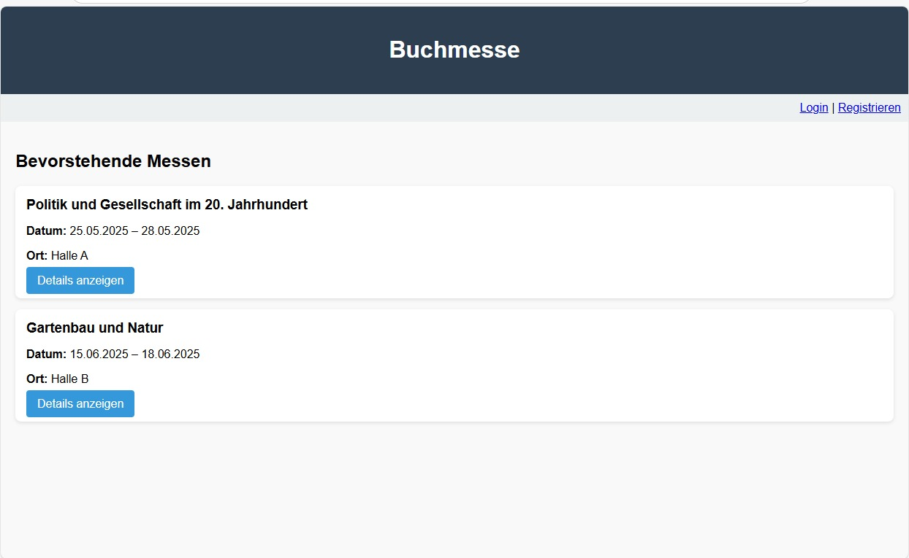

:project_name: Book fair
:company_name: Leifurter Buchmessen AG
:toc: left
:numbered:
= Pflichtenheft __{project_name}__

== Summary
The objective of this specification document is to provide a clear overview of the planned software product and to establish a common communication basis between the client and the contractor (Group 4).
It contains a comprehensive description of the project, the specific assignment, the involved stakeholders, various illustrative diagrams, as well as the functional and non-functional requirements. Additionally, a GUI prototype is presented.
This specification document serves as the basis for a potential contract between the client and the contractor.

== Task Definition and Objectives

{company_name} hosts several book fairs on its premises each year, covering various themes such as horticulture, politics, modern history, and novels from the 18th and 19th centuries.

Relevant publishing houses traditionally rent exhibition stands to:
  
  *  present their publishing portfolio to a professional audience
  *  accept orders from booksellers
  *  negotiate contracts with authors for new book projects

To modernize the booking and management of these sales stands, Leifurter Buchmesse AG is planning the development of a web-based solution.
The goal is to create a system prototype that automates the most important processes and can be expanded into a fully functional application system if needed.

Currently, the exhibition grounds include three halls, with four additional halls in the planning phase. Each hall can accommodate between 20 and 80 sales stands. The rental price of a stand depends on its size (in multiples of 10 m²) and its location (categories A to D).
Stand equipment such as display surfaces, shelves, counters, seating areas, and coffee machines can be rented from the fair company at a low price and should also be managed digitally to facilitate the setup of the sales stands.

A software solution for personnel management is already in place, which provides access to annual total personnel costs at any time. These costs, along with other fixed costs, are partially allocated to the financial accounting of each fair and should also be represented digitally.

In addition, the existing event calendar is to be digitized. It includes all fairs from the past and the upcoming twelve months, supplemented by statistical data such as:

  *  total number of visitors
  *  number of participating publishers
  *  total revenue from book sales
  *  number of book contracts concluded

A booking overview should also be integrated, clearly displaying the booked sales stands and the requested equipment for each planned fair.

== Product Use
This section describes how the developed system is intended to be used after its completion and under which conditions it will operate.
The system is intended for use by Leifurter Buchmesse AG. It will function as a website, hosted on a server and accessible via the internet around the clock (24/7) through a web browser.

The software will be optimized for the following browsers:

  *  Mozilla Firefox, version 92.0.1+
  *  Google Chrome, version 94.0.4606+

The system will primarily be used by employees of Leifurter Buchmesse AG who are responsible for the planning, execution, and follow-up of the book fairs. This includes tasks such as maintaining the fair calendar and managing exhibition halls and sales booths.
Other users or customers of Leifurter Buchmesse AG may also use the system to register their publishing companies for the fair or to view news and updates.

Users of the system are expected to have basic knowledge of how to use a typical website. However, no programming or technical background is required. The system is designed to be flexible and user-friendly.

No technical support is needed, as Leifurter Buchmesse AG has its own developers. All information is stored in a database hosted on the company’s own server. All data is openly accessible within the system, and employees can create and manage data through the UI (User Interface).
This allows for flexible usage without the need for direct SQL interaction.

== Stakeholder
Stakeholders are groups or individuals who have a legitimate interest in and influence over the system.
They are presented in the following table along with their objectives.

[options="header"]
[cols="1, 1, 1"]

|===
| Name 
| Description 
| Objectives

| Organisator {company_name} 
| Is the client and at the same time the Product-Owner 
a| 
  *  get more publisher
  *  automate the process
  *  avoid mistakes by human

| Publisher 
| Users who mainly use the system and revenue source 
a| 
  *  a friendly userinterface
  *  a fast process of booking

| Administrators
| Users responsible for the management of the trade fair and bookings
a|
  *  get fast a simple overview about data
  *  manage data

| Developer 
| Individuals who develop the design and implement and test the application
a|
  *  expandable system prototype
  *  easly modifyable system 
|===

== System Boundary and Top-Level Architecture
=== Context Diagram
The system context diagram illustrates the planned system within its environment. This includes all types of users, their access capabilities to the system, as well as third-party systems that either access our system or are accessed by it.

=== Top-Level Architecture

== Use Cases

This section outlines the key use cases the system must support. Each use case defines a specific functionality from the client’s perspective and identifies the relevant actors involved. These scenarios serve as the foundation for understanding how the system will be utilized in a real-world context.

=== Actors
Actors represent either users or external systems that interact with the system. The table below provides an overview of all identified actors, along with a brief description of each. Abstract actors—displayed in italic—are used to represent groups of related actors for the purpose of generalization and simplification

[options="header", cols="1, 1"]
|===
| User
| Description

| unauthorized User
| Users who are not logged in and only sees the Catalog

| Customer
| Any User, who has the role Customer and buys the products (Booths and equipment).

| Admin
| Users who have the role Admin and administrate the application. They have access to the event calender, the equipment warehouse, balance sheet as well as the occupancy plan.

|===

=== Use Case Diagrams

=== Use Case Description

[cols="1h, 3"]
[[U001]]
|===
| ID                               | U001
| Name                             | Login
| Description                      | The unauthorized User shall be able to login and authorize with the system to access further functionality.
| Actor                            | Customer and Admin
| Essential Steps                  a| 
1. User accesses "Login" in the navigation bar
2. User enters his E-Mail and password
3. User hits "Login" button

| Functional Requirements          | <<F001>>
|===

[cols="1h, 3"]
[[U002]]
|===
| ID                               | U002
| Name                             | Logout
| Description                      | The authorized user shall be able to log out again.
| Actor                            | Customer and Admin
| Essential Steps                  | 1. User hits „Log out“ button in the navigation bar
| Functional Requirements          | <<F002>>
|===

[cols="1h, 3"]
[[U003]]
|===
| ID                               | U003
| Name                             | Registration
| Description                      | The unauthorized user shall be able to create an account.
| Actor                            | Customer
| Essential Steps                 a| 
1. Unauthorized User presses the „Register“ button
2. He enters his desired E-Mail, password and his publisher name
3. He clicks the „create Account“ button

| Functional Requirements          | <<F003>>
|===

[cols="1h, 3"]
[[U004]]
|===
| ID                               | U004
| Name                             | View Events
| Description                      | Customer should be able to see available book fair events
| Actor                            | Customer
| Essential Steps                 a| 
1. User clicks on the „View Event“ tab

| Functional Requirements          | <<F004>>
|===

[cols="1h, 3"]
[[U005]]
|===
| ID                               | U005
| Name                             | View Registered Event
| Description                      | The Customer shall be able to view the contents of his registered Event.
| Actor                            | Customer
| Essential Steps                 a| 
1. Customer clicks „View Registered Event“ button in the navigation bar
2. Customer is shown his bookings as well as details of event

| Functional Requirements          | <<F005>>
|===

[cols="1h, 3"]
[[U006]]
|===
| ID                               | U006
| Name                             | View Customer
| Description                      | Admin should be able to see how many customer an event will have
| Actor                            | Admin
| Essential Steps                 a| 
Add:

1. The Admin clicks on „View Customer“ in an Event

| Functional Requirements          | <<F006>>
|===

[cols="1h, 3"]
[[U007]]
|===
| ID                               | U007
| Name                             | View Event Calendar
| Description                      | the Customer should be able to see a calendar of events
| Actor                            | Customer
| Essential Steps                 a| 
1. The Customer presses the button „Calendar“ in the navigation bar
| Functional Requirements          | <<F007>>
|===

[cols="1h, 3"]
[[U008]]
|===
| ID                               | U008
| Name                             | Join Events
| Description                      | Customer can join Events
| Actor                            | Customer
| Essential Steps                  a|
1. Customer presses "Join Event" in the Cart

| Functional Requirements          | <<F008>>
|===

[cols="1h, 3"]
[[U009]]
|===
| ID                               | U009
| Name                             | Cancel Join Event
| Description                      | The Customer shall be able to cancel his bookings.
| Actor                            | Customer
| Essential Steps                 a| 
1. The Customer presses the button „Cancel Join Event“ in the navigation bar

| Functional Requirements          | <<F009>>
|===

[cols="1h, 3"]
[[U010]]
|===
| ID                               | U010
| Name                             | Add News
| Description                      | The Admin shall be able to add news.
| Actor                            | Admin
| Essential Steps                 a| 

| Functional Requirements          | <<F010>>
|===

[cols="1h, 3"]
[[U011]]
|===
| ID                               | U011
| Name                             | Delete News
| Description                      | The Admin shall be able delete news
| Actor                            | Admin
| Essential Steps                 a|
1. The Admin clicks on the the button „Delete News“ in the navigation

| Functional Requirements          | <<F011>>
|===

[cols="1h, 3"]
[[U012]]
|===
| ID                               | U012
| Name                             | add Events
| Description                      | The Admin shall be able to add events from the Calendar
| Actor                            | Admin
| Essential Steps                 a| 
1. The Admin clicks in the navigation on the button „Event Calendar“
2. The Admin can click on „Add Event“ 
| Functional Requirements          | <<F012>>
|===

[cols="1h, 3"]
[[U013]]
|===
| ID                               | U013
| Name                             | Delete Event
| Description                      | The Admin shall be able to delete an event.
| Actor                            | Admin
| Essential Steps                 a|
1. The Admin click on "delete" Event

| Functional Requirements          | <<F013>>
|===

[cols="1h, 3"]
[[U014]]
|===
| ID                               | U014
| Name                             | Add Blog
| Description                      | Admin can add new blog to make the website more compelling
| Actor                            | Admin
| Essential Steps                  | 1. The Admin clicks on the button „add new blog“
| Functional Requirements          | <<F014>>
|===

[cols="1h, 3"]
[[U015]]
|===
| ID                               | U015
| Name                             | Delete Blog
| Description                      | The Admin shall be able to remove blog.
| Actor                            | Admin
| Essential Steps                 a| 
Add:
1. The Admin clicks on the button „Delete blog“ on the Booth or equipment

| Functional Requirements          | <<F015>>
|===

[cols="1h, 3"]
[[U016]]
|===
| ID                               | U016
| Name                             | Payment System
| Description                      | System should be able to include a secure payment for the customer.
| Actor                            | System
| Essential Steps                 a|

| Functional Requirements          | <<F016>>
|===

== Functional Requirements

=== Must-Have Criteria
[options="header", cols="1, 1, 1, 1, 1"]
|===
| ID
| Titel
| Status
| Description
| Evaluation criteria

[[F001]]
| F001
| Authentication
| open
| The system should provide registered users to authenticate and login.
| There is a button for a login which leads to a new mask with input fields for E-Mail and password. If logged in successful, the user should be redirected to the customer/admin-view.

[[F002]]
| F002
| Logout
| open
| The system should provide registered users to logout again.
| There is a button to logout. If logged out successful, the user should be redirected to the home-page again.

[[F003]]
| F003
| Registration
| open
| The system shall provide new (not registered) users to register with a E-Mail, password and the name of the publisher.
| There is a button for the registration and a mask with input fields of the E-Mail, password and publisher. If registered successfully, the user should be redirected to the customer/admin view and should be added to the Customer-list.

[[F004]]
| F004
| View Events
| open
| The system shall enable a User to access and view Events Available.
|

[[F005]]
| F005
| View Registered Event
| open
| The system shall provide the Customer the ability to view his Registered Event.
|

[[F006]]
| F006
| View Customer
| open
| Admin should be able to see how many customer an event will have 
|

[[F007]]
| F007
| View Event Calendar
| open
| The system should provide the ability to remove a booking from his Cart.
| There should be a button "Remove" in Cart-page to remove a Booking from the Customers Cart.

[[F008]]
| F008
| Join Events
| open
| The system should provide the Customer the possibility to Join an events and to provide a payment system on the next step
|

[[F009]]
| F009
| Cancel join event
| open
| The system should provide the Customer the possibility to cancel joined events
|

[[F010]]
| F010
| Add news
| open
| Admin should be able to add news
|

[[F011]]
| F011
| Remove news
| open
| Admin should be able to remove news
|

[[F012]]
| F012
| Add event
| open
| Admin should be able to add Event
|

[[F013]]
| F013
| Delete Events
| open
| Admin should be able to delete Event
|

[[F014]]
| F014
| Add Blog
| open
| Admin should be able to add blog on the website 
|

[[F015]]
| F015
| Remove Blog
| open
| Admin Should be able to remove blog on the website
|

[[F016]]
| F016
| Payment system
| open
| The system shall provide the Customer the ability to pay
|

|===

=== Nice-to-Have Criteria

[options="header", cols="1, 1, 1, 1, 1"]
|===
| ID
| Titel
| Status
| Description
| Evaluation criteria

| F901
| Filter Event Calender
| open
a| The system shall be able to filter the calender with:

  *  time
  *  events 
  *  halls
| There should be input fields to search and filter for specific parts. If used, it should only show the parts wich match the filter criterias. It should also be possible to reset the filter to show every entry.

| F902
| Filter Event Orders
| open
a| The system shall provide the Admin the ability to filter the calender with:

  *  publisher
  *  halls
  *  stand
| There should be input fields to search and filter for specific parts. If used, it should only show the parts wich match the filter criterias. It should also be possible to reset the filter to show every entry.

| F903
| Change Event
|open
| The system shall provide the Admin the ability to change entered event informations (date and name). 
| There should be a button for events to change the entered informations and save it.

|===

== Non-Functional Requirements
Non-functional requirements are the property of the system ans is used to measure the quality of the system.

Priority: 1 - low ; 5 - high.
[options="header", cols="1, 1, 1, ^1"]
|===
| ID
| Titel
| Description
| Priority

| 001
| Security
| The system must be secured by authentication and role assignment to avoid attacks or manipulation in the system.
| 2

| 002
| Data protection
| The system shall be GDPR conform to ensure a compliant data handling.
| 2

| 003
| Performance 
| The load time for every user-interaction should be less then 2 seconds for 90% of requests, to ensure a fast and smooth operation.
| 4

| 004 
| Usability
| The user interface must be designed in such a way that the navigation is intuitive, and the applicant can quickly find all the required functions without needing additional instructions or training.
| 5

| 005
| Reliability
|The system must ensure an availability of at least 99% on an annual average. In case of failures, the system must be restored within 4 hours to ensure continuous usage.
| 3

| 006
| Scalability
| The system must be scalable to ensure good performance even with an increasing number of requests and users.
| 5

| 007
| Flexibility & Maintainability
| The system must be designed for easy adaptation to changing requirements or technologies. It should have a modular architecture, allowing new functionalities or adjustments to be added without significant disruption. All changes must be documented and traceable, ensuring efficient maintenance and extension.
| 4

| 008
| Protocolation
| The system must log all system activities, including login attempts, application changes, system errors, and critical events. The logs must be securely archived and retained for at least 5 years in compliance with legal requirements.
| 3

| 009
| Documentation
| There must be comprehensive documentation available for the system, describing both the software architecture and the specific implementations, to facilitate long-term maintenance and further development.
| 5

|===

== GUI Prototype

== Data Model
=== Overview: Class Diagrams

image::./models/analysis/Klassendiagramm.svg[context diagram, 100%, 100%, pdfwidth=100%, title= "Context diagram of the {project_name} in UML", align=center]

=== Classes and Enumeration

[options="header", cols="1, 3"]
|===
| Class/Enumeration
| Description

| User
| General representation of a real person who uses the system.

| Customer
| A registered user who can book booths at the book fair as a publisher or exhibitor.

| Administrator
| A registered user who manages the system. Has access to all functions, including fair management and financial evaluations.

| Hall
| An event area of the book fair that contains multiple booths. A hall has a defined capacity and operational costs.

| Fair
| Core class of the system. Represents a single book fair with a theme, date, and general information.

| Registered User
| A user who has registered and authenticated within the system.
|===
