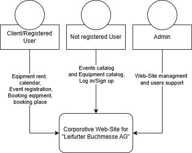
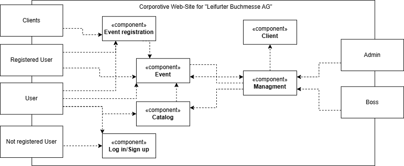

:project_name: Book fair
:company_name: Leifurter Buchmessen AG
:toc: left
:numbered:
= Pflichtenheft __{project_name}__ 

== Summary
The objective of this specification document is to provide a clear overview of the planned software product and to establish a common communication basis between the client and the contractor (Group 4).
It contains a comprehensive description of the project, the specific assignment, the involved stakeholders, various illustrative diagrams, as well as the functional and non-functional requirements. Additionally, a GUI prototype is presented.
This specification document serves as the basis for a potential contract between the client and the contractor.

== Task Definition and Objectives

{company_name} hosts several book fairs on its premises each year, covering various themes such as horticulture, politics, modern history, and novels from the 18th and 19th centuries.

Relevant publishing houses traditionally rent exhibition stands to:
  
  *  present their publishing portfolio to a professional audience
  *  accept orders from booksellers
  *  negotiate contracts with authors for new book projects

To modernize the booking and management of these sales stands, Leifurter Buchmesse AG is planning the development of a web-based solution.
The goal is to create a system prototype that automates the most important processes and can be expanded into a fully functional application system if needed.

Currently, the exhibition grounds include three halls, with four additional halls in the planning phase. Each hall can accommodate between 20 and 80 sales stands. The rental price of a stand depends on its size (in multiples of 10 m²) and its location (categories A to D).
Stand equipment such as display surfaces, shelves, counters, seating areas, and coffee machines can be rented from the fair company at a low price and should also be managed digitally to facilitate the setup of the sales stands.

A software solution for personnel management is already in place, which provides access to annual total personnel costs at any time. These costs, along with other fixed costs, are partially allocated to the financial accounting of each fair and should also be represented digitally.

In addition, the existing event calendar is to be digitized. It includes all fairs from the past and the upcoming twelve months, supplemented by statistical data such as:

  *  total number of visitors
  *  number of participating publishers
  *  total revenue from book sales
  *  number of book contracts concluded

A booking overview should also be integrated, clearly displaying the booked sales stands and the requested equipment for each planned fair.

== Product Use
This section describes how the developed system is intended to be used after its completion and under which conditions it will operate.
The system is intended for use by Leifurter Buchmesse AG. It will function as a website, hosted on a server and accessible via the internet around the clock (24/7) through a web browser.

The software will be optimized for the following browsers:

  *  Mozilla Firefox, version 92.0.1+
  *  Google Chrome, version 94.0.4606+

The system will primarily be used by employees of Leifurter Buchmesse AG who are responsible for the planning, execution, and follow-up of the book fairs. This includes tasks such as maintaining the fair calendar and managing exhibition halls and sales booths.
Other users or customers of Leifurter Buchmesse AG may also use the system to register their publishing companies for the fair or to view news and updates.

Users of the system are expected to have basic knowledge of how to use a typical website. However, no programming or technical background is required. The system is designed to be flexible and user-friendly.

No technical support is needed, as Leifurter Buchmesse AG has its own developers. All information is stored in a database hosted on the company’s own server. All data is openly accessible within the system, and employees can create and manage data through the UI (User Interface).
This allows for flexible usage without the need for direct SQL interaction.

== Stakeholder
Stakeholders are groups or individuals who have a legitimate interest in and influence over the system.
They are presented in the following table along with their objectives.

[options="header"]
[cols="1, 1, 1"]

|===
| Name 
| Description 
| Objectives

| Organisator {company_name} 
| Is the client and at the same time the Product-Owner 
a| 
  *  get more publisher
  *  automate the process
  *  avoid mistakes by human

| Publisher 
| Users who mainly use the system and revenue source 
a| 
  *  a friendly userinterface
  *  a fast process of booking

| Author 
| Users/Vistitors who can also book stands or are part of a publishing house. They can, for example, hold readings from their books, sign books, and engage with visitors.
a| 
  *  a friendly userinterface
  *  a fast process of booking

| Booksellers 
| Visitors who can discover new books for their own stores, establish contacts with publishers or authors, and purchase books from them.
a| *  get fast a simple overview about upcoming book fairs

| Visitors
| Visitors who mainly want to dicover new books and meet their favourite authors
a| *  get fast a simple overview about upcoming book fairs

| Media/Press
| Visitors who cover new releases and emerging trends. They conduct interviews, create reports, and publish articles to reach a broader audience.
a| *  get fast a simple overview about upcoming book fairs

| Developer 
| Individuals who develop the design and implement and test the application
a|
  *  expandable system prototype
  *  easly modifyable system 
|===

== System Boundary and Top-Level Architecture
=== Context Diagram
The system context diagram illustrates the planned system within its environment. This includes all types of users, their access capabilities to the system, as well as third-party systems that either access our system or are accessed by it.

=== Top-Level Architecture

image::./models/analysis/Kontext-Diagramm_C4_C3.png[context diagram, 100%, 100%, pdfwidth=100%, title= "Context diagram of the {project_name} in UML", align=center]

== Use Cases

This section outlines the key use cases the system must support. Each use case defines a specific functionality from the client’s perspective and identifies the relevant actors involved. These scenarios serve as the foundation for understanding how the system will be utilized in a real-world context.

=== Actors
Actors represent either users or external systems that interact with the system. The table below provides an overview of all identified actors, along with a brief description of each.

[options="header", cols="1, 1"]
|===
| User
| Description

| unauthorized User
| Users who are not logged in and only sees the Homepage with upcoming Events as well as the details of book fairs.

| Customer
| Any User, who has the role Customer and buys the products (Booths and equipment).

| Admin
| Users who have the role Admin and administrate the application. They have access to the Magagement-Dashboard which provides an overview about current events, a balance overview as well as an Calendar for events. He can also manage halls, stands and equipment as well as creating new book fairs.

|===

=== Use Case Diagrams
image::./models/analysis/Use-Case_Diagram.svg[context diagram, 100%, 100%, pdfwidth=100%, title= "Use Case Diagram of the {project_name} in UML", align=center]

=== Use Case Description

[cols="1h, 3"]
[[U001]]
|===
| ID                               | U001
| Name                             | Login
| Description                      | The unauthorized User shall be able to login and authorize with the system to access further functionality.
| Actor                            | Customer, Admin and Boss
| Functional Requirements          | <<F001>>
|===

[cols="1h, 3"]
[[U002]]
|===
| ID                               | U002
| Name                             | Logout
| Description                      | The authorized user shall be able to log out again.
| Actor                            | Customer, Admin and Boss
| Functional Requirements          | <<F002>>
|===

[cols="1h, 3"]
[[U003]]
|===
| ID                               | U003
| Name                             | Registration
| Description                      | The unauthorized user shall be able to create an account.
| Actor                            | Customer
| Functional Requirements          | <<F003>>
|===

[cols="1h, 3"]
[[U004]]
|===
| ID                               | U004
| Name                             | Book Stand
| Description                      | The Customer shall be able to see and book available stands of upcoming events.
| Actor                            | Customer
| Functional Requirements          | <<F004>>, <<F006>>, <<F007>>, <<F008>>, <<F009>>
|===

[cols="1h, 3"]
[[U005]]
|===
| ID                               | U005
| Name                             | Book Equipment
| Description                      | The Customer shall be able to book equipment for the selected stand and finalize the payment by booking it.
| Actor                            | Customer
| Functional Requirements          | <<F005>>, <<F006>>, <<F007>>, <<F008>>, <<F009>>
|===

[cols="1h, 3"]
[[U006]]
|===
| ID                               | U006
| Name                             | Manage Halls
| Description                      | The Admin shall be able to manage halls for events. He can add and remove halls as well as change the propertys like size.
| Actor                            | Admin
| Functional Requirements          | <<F010>>
|===

[cols="1h, 3"]
[[U007]]
|===
| ID                               | U007
| Name                             | Manage Stands
| Description                      | The Admin shall be able to manage stands of halls. He can add or remove stands from halls as well as change the propertys like size, category or price.
| Actor                            | Admin
| Functional Requirements          | <<F011>>
|===

[cols="1h, 3"]
[[U008]]
|===
| ID                               | U008
| Name                             | Manage Equipment
| Description                      | The Admin shall be able to manage equipment of stands. He can add or remove equipment as well as change the propertys like quantaty, size or price.
| Actor                            | Admin
| Functional Requirements          | <<F012>>
|===

[cols="1h, 3"]
[[U009]]
|===
| ID                               | U009
| Name                             | Manage Events
| Description                      | The Admin shall be able to manage events. He can add or remove events as well as change the propertys like name or the halls they use.
| Actor                            | Admin
| Functional Requirements          | <<F013>>
|===

== Sequence Diagram

== Functional Requirements

=== Must-Have Criteria
[options="header", cols="1, 1, 1, 1, 1"]
|===
| ID
| Titel
| Status
| Description
| Evaluation criteria

[[F001]]
| F001
| Authentication
| open
| The system should provide registered users to authenticate and login.
a| * There is a Button for a Login. If pressed, it will lead to a new mask with input fields for E-mail and password
* Email and password will be verfified. If successfull, the user should be redirected to the registered Users view.

| [[F002]] F002
| Logout
| open
| The system should provide registered users to logout again.
a| * There is a button to logout for registered users. If pressed, the user should be redirected to the home-page and get unauthorized again.

| [[F003]] F003
| Registration
| open
| The system shall provide new (not registered) users to register with a E-Mail, password and the name of the publisher.
a| * There is a button for the registration. If pressed, the unregistered user will see a mask with input fields for the E-Mail, password and publisher-name. 
* If registered successfully (filled everything), the user should be redirected to the customer/admin view and should be added to the Customer-list.

| [[F004]] F004
| Select a Stand
| open
| The system should provide Customers the possibility to select an Event and choose a Stand to book. The Stands variates by size and category, which influence the price of the booth.
a| * In the Detail-View the system shall provide fields with buttons, each representing a Stand. If pressed ("Book Now") the user will get to the Configuration view.

| [[F005]] F005
| Select Equipment
| open
| The system should provide Customers in the Configuration view to choose equipment for the selected stand. There are various equipments which have different names and prices.
a|  * For each equipment exist a drop down menu to choose the wished quantity. 
*  If a quantity is selected, the price will be added to the total price.

| [[F006]] F006
| Book Stand with Equipment
| open
| The system should provide registered users to buy/book the choosed stand with equipment (optional) and pay for it.
a|  * The system shall provide Customers the posibillity to buy their final choice of the stand and equipment by pressing the button "Confirm Booking". 
*  If pressed, an Order will be created and be validated. 

| [[F007]] F007
| Create Order
| open
| The system should provide the possebility to create a new Order with the status "OPEN".
a|  * The system creates an Order after the user pressed "Confirm Booking" and set the status of the Order to "OPEN".

| [[F008]] F008
| Validate Order
| open
| The system should provide the possebility to validate a new Order.
a| *  The system will validate the order by checking the current stock.
*  If the selected quantity exceeds the available stock, an error message will notify the user, and the order will be cleared.
*  If the order is valid, it will proceed the payment.

| [[F009]] F009
| Pay Order
| open
| The system shall provide the functionality to pay an existing order. If payed, the Order will be archived.
a| *  The system confirms the payment and set the status of the Order to "PAID"
*  The Order will be saved in the "Order-Database".

| [[F010]] F010
| Manage Halls
| open
| The system shall provide the Admin the possibility to add, change and remove Halls.
a| *  In the Admin-Dashboard the Admin has a button "Manage Halls". If pressed, the Admin will be redirected to the Manage-Halls-View. 
*  ...

| [[F011]] F011
| Manage Stands
| open
| The system shall provide the Admin the possibility to add, change and remove Stands.
a| *  In the Admin-Dashboard the Admin has a button "Manage Stands". If pressed, the Admin will be redirected to the Manage-Stands-View. 
*  ...

| [[F012]] F012
| Manage Equipment
| open
| The system shall provide the Admin the possibility to add, change and remove Equipment.
a| *  In the Admin-Dashboard the Admin has a button "Manage Equipment". If pressed, the Admin will be redirected to the Manage-Equipment-View. 
*  ...

| [[F013]] F013
| Manage Events
| open
| The system shall provide the Admin the possibility to add and remove Book fairs of the system.
a| *  In the Admin-Dashboard the Admin has a button "Manage Events". If pressed, the Admin will be redirected to the Manage-Events-View. 
*  ...

| [[F014]] F014
| View Homepage
| open
| The system shall provide all users the possibility to see the Homepage.
a| *  ...

| [[F015]] F015
| View Details
| open
| The system shall provide all users the possibility to see Details of a selected event(book fair).
a| *  For each upcoming event in the Homepage will be a button "View Details", which redirects the user to the Detail-View.

| [[F016]] F016
| View Configurations
| open
| The system shall allow all registered users to access the Configuration View for a selected stand. In this view, the details of the selected stand will be displayed, along with any available equipment that can be booked for the stand
a| *  When a Customer selects a stand in the Detail View, they will be redirected to the Configuration View.

| [[F017]] F017
| View Admin-Dashboard
| open
| The system shall provide the Admin the possibility to see a overview of the Event Calendar and a short balance.
a| *  When the Admin is logged in, he will be redirected to the Admin-Dashboard-View.

|===
=== Nice-to-Have Criteria

[options="header", cols="1, 1, 1, 1, 1"]
|===
| ID
| Titel
| Status
| Description
| Evaluation criteria

| F901
| Filter Event Calender
| open
a| The system shall be able to filter the calender with:

  *  time
  *  events 
  *  halls
| There should be input fields to search and filter for specific parts. If used, it should only show the parts wich match the filter criterias. It should also be possible to reset the filter to show every entry.

| F902
| Filter Event Orders
| open
a| The system shall provide the Admin the ability to filter the calender with:

  *  publisher
  *  halls
  *  stand
| There should be input fields to search and filter for specific parts. If used, it should only show the parts wich match the filter criterias. It should also be possible to reset the filter to show every entry.

| F903
| Change Event
| open
| The system shall provide the Admin the ability to change entered event informations (date and name). 
| There should be a button for events to change the entered informations and save it.

|===

== Non-Functional Requirements
Non-functional requirements are the property of the system ans is used to measure the quality of the system.

Priority: 1 - low ; 5 - high.
[options="header", cols="1, 1, 1, 1, ^1"]
|===
| ID
| Titel
| Description
| Criteria
| Priority

| 001
| Security
| The system must be secured by authentication and role assignment to avoid attacks or manipulation in the system.
| The system will use the spring-security module to enable authentication and role assignemt.
| 2

| 002
| Data protection
| The system shall be GDPR conform to ensure a compliant data handling.
| The user will be notified about which infomration and data will be saved of him. Further the user can see his own informations.
| 2

| 003
| Performance 
| The load time for every user-interaction should be less then 2 seconds for 90% of requests, to ensure a fast and smooth operation.
| The Controller will be scripted simple and only reads and loads neccesary data.
| 4

| 004 
| Usability
| The user interface must be designed in such a way that the navigation is intuitive, and the applicant can quickly find all the required functions without needing additional instructions or training.
| There will be a Navigation bar so the user can easily navigate between the different views. ...
| 5

| 005
| Reliability
|The system must ensure an availability of at least 99% on an annual average. In case of failures, the system must be restored within 4 hours to ensure continuous usage.
| In case of Errors it will be logged in the Documentation. The Developer will then look it up and try to solve it.
| 3

| 006
| Scalability
| The system must be scalable to ensure good performance even with an increasing number of requests and users.
| Because the data will be saved in a Database, it ensures 
| 5

| 007
| Flexibility & Maintainability
| The system must be designed for easy adaptation to changing requirements or technologies.
|  It should have a modular architecture, allowing new functionalities or adjustments to be added without significant disruption. All changes must be documented and traceable, ensuring efficient maintenance and extension.
| 4

| 008
| Protocolation
| The system must log all system activities, including login attempts, application changes, system errors, and critical events. The logs must be securely archived and retained for at least 5 years in compliance with legal requirements.
| The system logs every action that the user triggers as well as the system itself. The Log will be saved in a Document.
| 3

| 009
| Documentation
| There must be comprehensive documentation available for the system, describing both the software architecture and the specific implementations, to facilitate long-term maintenance and further development.
| The Documentaion will be written down in the Pflichtenheft, the Developer Documentation as well as in the Code.
| 5

|===

== GUI Prototype

== Data Model
=== Overview: Class Diagrams

image::./models/analysis/Klassendiagramm.svg[context diagram, 100%, 100%, pdfwidth=100%, title= "Context diagram of the {project_name} in UML", align=center]

=== Classes and Enumeration

[options="header", cols="1, 3"]
|===
| Class/Enumeration
| Description

| User
| General representation of a real person who uses the system.

| Customer
| A registered user who can book booths at the book fair as a publisher or exhibitor.

| Administrator
| A registered user who manages the system. Has access to all functions, including fair management and financial evaluations.

| Hall
| An event area of the book fair that contains multiple booths. A hall has a defined capacity and operational costs.

| Fair
| Core class of the system. Represents a single book fair with a theme, date, and general information.

| Registered User
| A user who has registered and authenticated within the system.
|===
